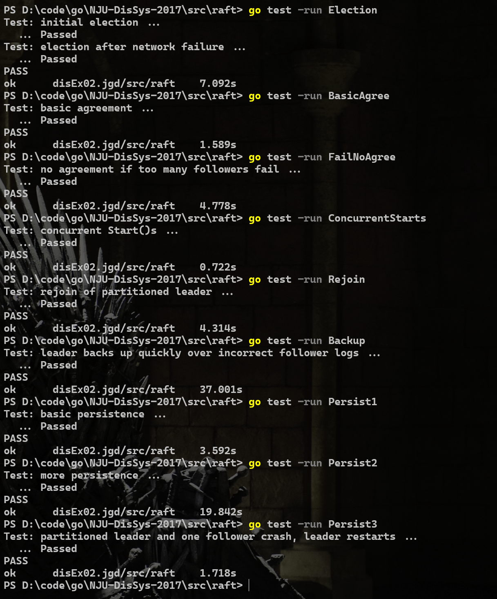

# ***RAFT*** 实验报告

## 1-概述

本实验实现了 `RAFT` `consensus algorithm` 的主体部分。主要又分为两个部分：

1. **Leader Election**
2. **Log Replication**

## 2-分析与设计

- **常量定义**

```go
const (
 // raft实例的身份
 leader    = 0
 candidate = 1
 follower  = 2

 // ElectionTimeout上下限（ms）
 MinElectionTimeout = 150
 MaxElectionTimeout = 300

 // 心跳（AppendEntries RPC）发送周期(ms)
 HeartBeatInterval = 75
)
```

- `Raft` 结构体

```go
type Raft struct {
 mu sync.Mutex

 peers []*labrpc.ClientEnd

 persister *Persister

 me int

 dead bool // 指示Raft是否被Kill()

 applyCh chan ApplyMsg

 RaftState // 将RaftState嵌入Raft中
}
```

- `RaftState` 结构体，存储 `Raft` 的状态信息

```go
type RaftState struct {
 CurrentTerm int

 VotedFor int

 Logs []LogEntry

 Role int

 VoteCnt int

 TimeStamp time.Time // 用于计时

 CommitIndex int

 LastApplied int

 NextIndex []int

 MatchIndex []int
}
```

- `RequestVoteArgs` 结构体

```go
type RequestVoteArgs struct {
 Term int

 CandidateID int

 LastLogIndex int

 LastLogTerm int
}
```

- `RequestVoteReply` 结构体

```go
type RequestVoteReply struct {
 Term int
    
 VoteGranted bool
}
```

- `AppendEntriesArgs` 结构体

```go
type AppendEntriesArgs struct {
 Term         int

 LeaderID     int

 PrevLogIndex int

 PrevLogTerm  int
 
 Entries      []LogEntry

 LeaderCommit int
}
```

- `AppendEntriesReply` 结构体

```go
type AppendEntriesReply struct {
 Term          int

 Success       bool

 ConflictIndex int

 ConflictTerm  int
}
```

- **计时方式**

> 没有使用 `time.Timer` 计时器来进行计时，而是采用循环检测的方式，依靠在 `Raft` 结构体中额外定义了一个 `time.Time` 类型的时间戳 `TimeStamp` 实现，根据现在时间与时间戳之间的 **时间间隔** 判断是否达到 `Election Timeout` 和 `HeartBeatTimeout`。在一个*goroutine*执行的 `ticker()` 函数中，首先设置一个 `ElectionTimeout`， 接着进入 `for` 循环，计算前述的 **时间间隔**，根据当前 `raft` 实例的身份进入不同的代码块。进入代码块后首先要进行时间长度比较，如果 **时间间隔** 大于所设置的各种时延，那么就进入相应的执行区域，否则进入下一次循环。

### ***2.1 Leader Election***

2.1.1 发送投票请求

> 当 `raft` 实例的身份是*follower*或*candidate*时，如果 **时间间隔** 大于设置的 `ElectionTimeout`，该 `raft` 实例进入选举阶段。开一个*goroutine*进行选举，并重置该 `raft` 实例的时间戳为当前时间，同时重新设置一个 `ElectionTimeout`。
>
> 进入选举过程，首先将该 `raft` 实例的身份设置为*candidate*，并且为自己投一票。接着构造投票请求参数 `reqArgs`，为集群中的每一个 `peer` 开一个协程进行投票请求。

2.1.2 接收投票请求并处理

> 请求接收者首先判断该*candidate*是否来自过时任期，如果是则拒绝该投票请求。否则再判断该*candidate*的日志是否 **up-to-date**，先比较该*candidate*的最后一条日志所属的任期与自己的最后一条日志所属的任期，如果前者小于后者，则说明该*candidate*的日志过时，拒绝为其投票；如果前者等于后者，则再比较该*candidate*的最后一条日志的索引号与自己的日志长度-1的大小，如果前者小于后者，则说明该*candidate*的日志过时，拒绝为其投票。否则为该*candidate*投票。

2.1.3 处理投票结果
> 如果请求的目标没有给自己投票，分为两种情况：
>
> - 目标的任期大于自己的任期，说明存在更高任期的*leader*，等待该*leader*发送心跳来进行任期更新。
> - 目标的任期不大于自己的任期，说明自己的日志不 **up-to-date**，降级为*follower*并加入该任期，等待该任期的*leader*发送心跳来进行日志更新。
>
> 如果请求的目标投票给自己，那么自己的票数+1，判断获得的票数是否大于集群服务器个数的一半，若大于则成为当前任期的*leader*。

### ***2.2 Log Replication***

2.2.1 发送日志追加RPC
> 当 `raft` 实例的身份是*leader*时，如果 **时间间隔** 大于设置的 `HeartBeatTimeout`，该 `raft` 实例进入日志复制阶段。开一个*goroutine*进行日志追加，并重置该 `raft` 实例的时间戳为当前时间。
>
> 进入日志复制过程，首先为集群中的每一个*follower*开一个协程进行日志追加过程，接着根据 `NextIndex` 构造日志追加的参数 `aeArgs`。
>
> 如果*leader*的最后一个日志条目的索引大于NextIndex中该目标*follower$_t$*对应的日志索引，说明有新的日志条目需要复制给该*follower*。将*leader*的日志中索引从NextIndex[$t$]开始的日志条目切片作为*RPC*参数之一。如果没有要复制的日志条目，则*RPC*中对应的参数设置为空切片。

2.2.2 接受日志追加RPC并处理

#### *前置判断*

> *follower*接收到该*RPC*后，首先检查*leader*所处的任期，如果*leader*的任期小于自己的任期，则可能是两种情况：
>
> - 自己是断连一段时间后重新连接的*follower*，则直接加入该任期，等待*leader*再次发送日志追加RPC。
> - *leader*是断连一段时间后重新连接的*leader*，则要提示该老*leader*加入新任期，此处使用的方法是置RPC响应中的$ConflictIndex=-2$。
>
> 不论是上述哪种情况，都置RPC响应中的$Success=false$，并直接返回。
>
> 如果*leader*的任期大于自己的任期，则加入该任期。
>
> 如果*leader*的任期与自己的任期相同，但是自己的$VotedFor != leader$的编号，则置$VotedFor=leader$的序号，并返回。

#### *日志追加*

> 接着判断该日志追加RPC中的日志条目切片是否为空。
>
> 如果为空，则说明不需要进行日志复制。
>
> 如果非空，则说明需要进行日志复制。
>
> 对于以上两种情况，都要先进行一致性检查，即判断该*leader*的日志与*follower*的日志是否冲突。
>
> 对于以下两种情况，可以判断一定有冲突：
>
> - *PrevLogIndex*大于*follower*的日志长度，直接返回；
> - *follower*的日志中没有与*PrevLog*匹配的日志，需要进一步细分冲突情况。
>
> 1. *follower*中有与*PrevLogIndex*匹配的日志，但是*PrevLogTerm*与*follower*中该日志的任期不同。这种情况下*follower*需要丢弃该日志条目及其之后的日志条目；
> 2. *follower*中没有与*PrevLogIndex*匹配的日志，这种情况下*follower*需要*leader*逐个向前回溯NextIndex。
>
> 对于有冲突的情况，将置$Success=false$。
>
> 对于要进行日志复制且没有冲突的情况下，直接进行日志复制。
>
> 对于不要进行日志复制且没有冲突的情况下，不执行操作。
>
> 最后无论是否需要日志复制，*follower*都要判断是有日志条目需要提交。
>
> 根据文中所述 "*If leaderCommit > commitIndex, set commitIndex = min(leaderCommit, index of last new entry)*"，判断是否需要提交日志。
>
> 最后的最后如果一切顺利执行，将置$Success=true$。

2.2.3 处理日志追加结果

> 首先判断是否有冲突。
>
> 如果有冲突，则判断ConflictIndex是否为-2，如果是，则说明该*leader*要加入新的任期。如果ConflictIndex不为-2，则置$NextIndex[t] = max(1, rf.NextIndex[t])$，防止*NextIndex*更新过快小于1。直接返回。
>
> 如果没有冲突，则更新MatchIndex和NextIndex的值。
>
> 最后判断是否有日志可以提交，即按文中"*If there exists an N such that N > commitIndex, a majority of matchIndex[i] ≥ N, and log[N].term == currentTerm: set commitIndex = N*"来判断是否有日志可以提交并*Apply*。

## 3-实验结果

### 测试结果图


